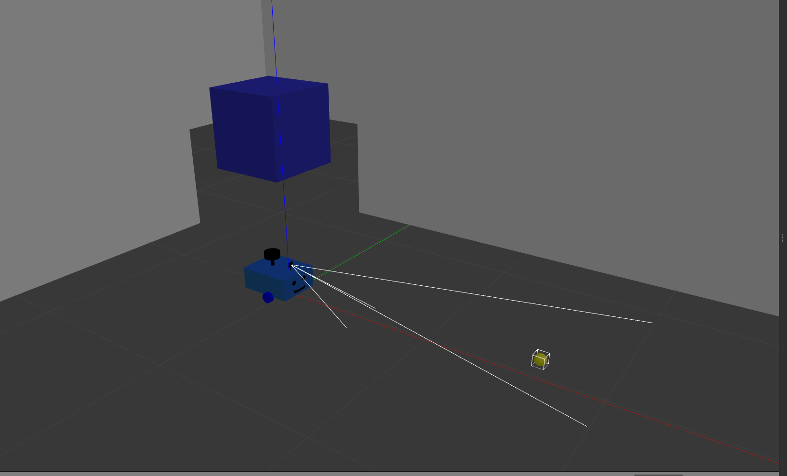
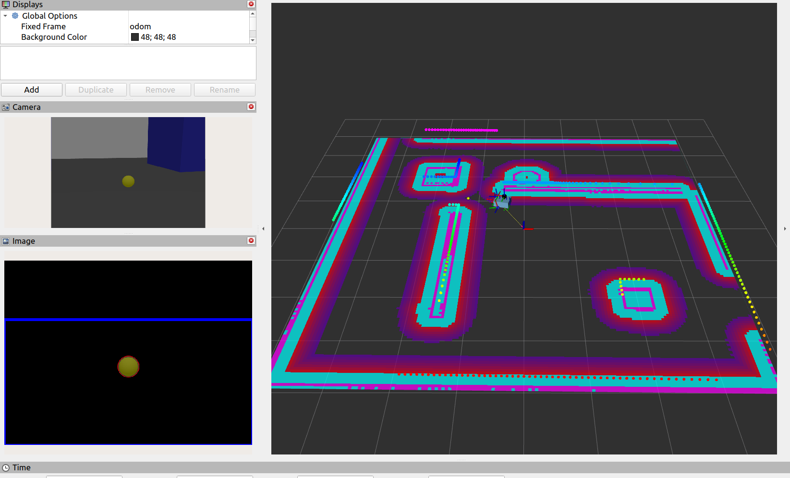
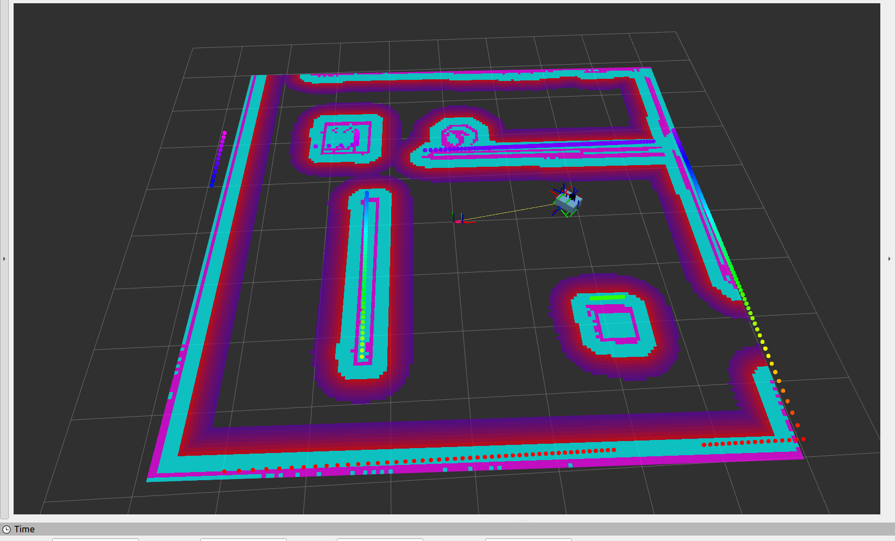

# 🤖 ROS 2 Autonomous Ball Rover

> An autonomous mobile robot simulation built with ROS 2 Humble, Gazebo, Nav2, SLAM, LiDAR, and OpenCV.


---

## 📸 Overview



**ROS 2 Autonomous Ball Rover** is an adapted and extended mobile robot simulation based on the mobile robot project by [Articulated Robotics](https://articulatedrobotics.xyz/tutorials/mobile-robot/project-overview).

The robot autonomously patrols a simulated environment using **Nav2**. While patrolling, it searches for a yellow ball using computer vision. When the ball is detected, the robot switches to ball-following mode. Once the ball is lost, the robot automatically resumes autonomous patrolling.

---

## ✨ Features

- 🤖 Autonomous mobile robot simulation
- 🧭 Autonomous navigation using Nav2
- 🗺️ SLAM-based mapping
- 📡 LiDAR-based environment perception
- 🟡 Yellow ball detection using OpenCV
- 🎯 Autonomous ball-following behavior
- 🧠 State Machine-based behavior control
- 🔄 Automatic switching between patrolling and ball following
- 🚗 Modified robot design
- 🌍 Gazebo simulation
- ⚙️ ROS 2 Humble compatible

---

## 🧠 How It Works

### 1. Autonomous Patrolling

The robot navigates between predefined waypoints using **Nav2**.

While moving, the camera continuously searches for a yellow ball.

---

### 2. Yellow Ball Detection

The camera image is processed using OpenCV to detect the yellow ball.

```text
Camera Image
      ↓
Image Processing
      ↓
Yellow Color Detection
      ↓
Ball Position
```



---

### 3. Ball Following

When the yellow ball is detected, the robot switches from autonomous navigation to ball-following mode.

The robot adjusts its movement according to the position of the ball in the camera image.

| Ball Position | Robot Behavior |
|---|---|
| Left | Turn Left |
| Center | Move Forward |
| Right | Turn Right |
| Not Detected | Resume Patrolling |

---

### 4. State Machine

The behavior of the robot is managed by a state machine:

```text
┌──────────────┐
│  PATROLLING  │
└──────┬───────┘
       │
       │ Ball Detected
       ▼
┌──────────────┐
│   FOLLOWING  │
│     BALL     │
└──────┬───────┘
       │
       │ Ball Lost
       ▼
┌──────────────┐
│  PATROLLING  │
└──────────────┘
```

This allows the robot to dynamically change its behavior based on visual information.

---

## 🗺️ Navigation and SLAM

The robot uses a LiDAR sensor to perceive the environment.

**SLAM Toolbox** is used for mapping and localization, while **Nav2** handles autonomous navigation and waypoint-based patrolling.



---

## 🏗️ System Architecture

```text
Camera
   │
   ▼
OpenCV Ball Detection
   │
   ▼
State Machine
   │
   ├──────────────► Nav2 Navigation
   │
   └──────────────► Ball Following
                          │
                          ▼
                    Mobile Robot
```

---

## 🛠️ Technologies

| Technology | Purpose |
|---|---|
| ROS 2 Humble | Robot middleware |
| Gazebo | Robot simulation |
| Nav2 | Autonomous navigation |
| SLAM Toolbox | Mapping and localization |
| LiDAR | Environment perception |
| OpenCV | Ball detection |
| Python | ROS 2 nodes and control logic |
| RViz2 | Visualization |

---

## 📁 Project Structure

The project is organized into ROS 2 packages containing the robot description, simulation, navigation, perception, and control components.

---

## ⚙️ Requirements

- Ubuntu 22.04
- ROS 2 Humble
- Gazebo
- Nav2
- SLAM Toolbox
- RViz2
- OpenCV
- Python 3

---

## 🚀 Installation

Create a ROS 2 workspace:

```bash
mkdir -p ~/ros2_ws/src
cd ~/ros2_ws/src
```

Clone the repository:

```bash
git clone https://github.com/moamir369/ros2-autonomous-ball-rover.git
```

Build the workspace:

```bash
cd ~/ros2_ws
colcon build
```

Source the workspace:

```bash
source install/setup.bash
```

---

## ▶️ Run the Project

Launch the complete system using:

```bash
ros2 launch ball_rover bringup.launch.py
```

The `bringup.launch.py` file is the main entry point for launching the robot simulation and its required components.

---

## 🔧 Adaptations and Extensions

This project is based on and adapted from the mobile robot project by **Articulated Robotics**.

The project was adapted and extended with the following modifications:

- Adapted the project for **ROS 2 Humble**.
- Modified the robot's visual design.
- Integrated **Nav2** with the ball-tracking system.
- Added autonomous patrolling between predefined waypoints.
- Added yellow ball detection using OpenCV.
- Added autonomous ball-following behavior.
- Implemented a State Machine for behavior management.
- Added automatic switching from patrolling to ball following.
- Added automatic return to patrolling when the ball is lost.
- Integrated the complete system through `bringup.launch.py`.

---

## 📚 Acknowledgments

This project is based on and adapted from the:

**[Mobile Robot Project by Articulated Robotics](https://articulatedrobotics.xyz/tutorials/mobile-robot/project-overview)**

The original project provided the foundation for the mobile robot simulation.

This version was adapted for **ROS 2 Humble** and extended with autonomous patrolling, yellow ball detection, ball-following behavior, and state-based behavior switching.

The original project structure and core concepts are credited to **Articulated Robotics**.

---

## 👨‍💻 Author

**Muhammet Emir Hallek**

Computer Engineering Student

**Interests:**

ROS 2 • Robotics • Autonomous Systems • Computer Vision • Embedded Systems • Artificial Intelligence

---

## 📄 License

This project is intended for educational and research purposes.

The original project and concepts are credited to Articulated Robotics.
